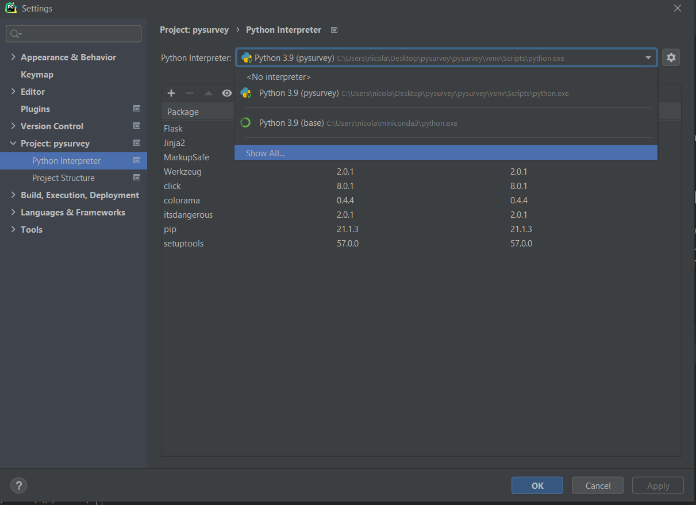
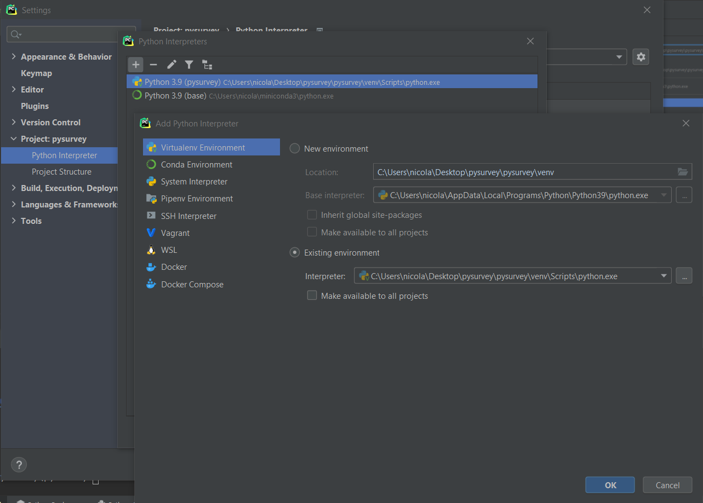

# pyquiz
Questo repository è nato per il progetto di basi di dati. Il progetto consiste in una piattaforma per creare questionari sviluppata in python con framework Flask.

#Configurazione preliminare
All'interno della sotto cartella pysurvey c'è un'altra cartella pysurvei e all'interno trovate l'ambiente python virtuale chiamato venv.
Per poterlo usare consiglio l'uso dell'IDE PyCharm. All'interno di esso dovete configurare un venv andando su file -> setting -> python interpreter

Una volta cliccato su show all usate il + per aggiungere il venv

Ricordate di selezionare python.exe nell'interprete all'interno della cartella venv/Scripts

#Runnare
Potete runnare l'applicazione in server di sviluppo usando il terminale posizionandovi nella sotto cartella pysurvey ed eseguendo **python run.py**

#Come sviluppare
Tutto il codice si trova nella cartella app. Per il front-end troviamo i file html nella cartella templates e le risorse css e js nella cartella static, purtroppo flask ha un modo tutto suo di fare le cose quindi l'html ha una sintassi particolare basata su segnaposti che vengono riempiti dal backend.
Lato Backend invece troviamo il codice python all'interno della cartella home per quanto riguarda le toutes e un altro init e il restante nella cartella app dove troviamo l'init e il config